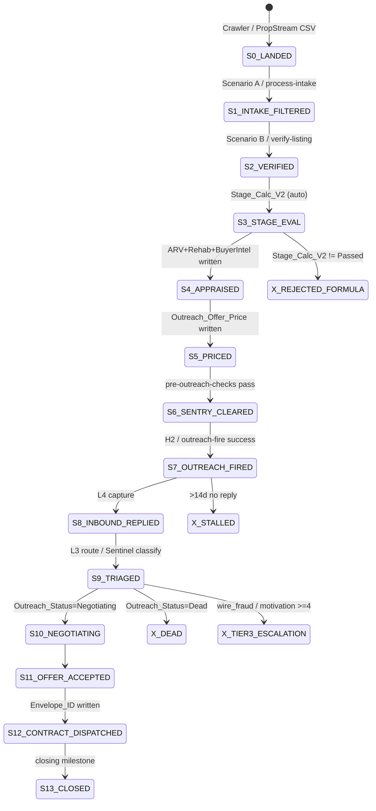

# AKB Belt v1 — Architectural Spec

**Document version:** v1.0
**Authored:** 2026-05-20 (Code — architectural design, not implementation)
**Branch:** `claude/fix-token-burn-cost-JUDad` (PR #5)
**Scope:** DESIGN-ONLY. No orchestrator code. No endpoint modifications. Every section traces to the Lost-Phone Test.
**Companion specs:** `AKB_MASTER_CHECKLIST.md` (procedural source of truth), `AKB_System_Inventory_v2.md` (live-state forensic baseline), `AKB_RealEstateTech_Gap_Analysis_v1.md` (outside-system gap map).
**Deferred specs (flagged in §8):** `AKB_Crawler_v1_Spec.md` (Crawler internals), vision-model spec (Phase 4B rehab vision input).

---

## §1 — Belt purpose & Lost-Phone alignment

The **belt** is the orchestration layer that moves a record from "landed in Listings_V1" to "contract dispatched" with zero operator intervention except the three sanctioned exceptions: (1) physical contract signature, (2) AI-flagged negotiation escalations (Tier 2+ Sentinel hits), (3) strategic decisions outside the funnel (new market, new monetization, new external account). Today the stations exist but are not wired into a single state-machine — records advance via mixed-mode pulls (Make scenario polls, dashboard fetches, operator-fired admin routes). The belt closes that gap by making advancement *event-driven* against persisted state, so the system progresses without an operator-watching-the-pipeline mental load.

**Passing the Lost-Phone Test on the belt's slice** means: a PropStream CSV (or Crawler-produced record) hitting Listings_V1 advances autonomously to outreach-fired-and-inbound-triaged, and a positive inbound reply reaches either auto-resolution or a Tier 2+ Sentinel escalation card on the operator's surface — **without Alex pulling out his phone to check, advance, or fire anything in between**. The three exceptions stay intact: contract signature (DocuSign click), negotiation escalation (Sentinel card click), strategic decision (rare).

---

## §2 — State machine design

States are persisted as combinations of existing Airtable fields. No new fields proposed (per spec constraint — any new field flagged in §8). State name in code = `belt_state` *inferred* from the field combination via a pure helper; not a stored singleSelect.

### States



### Transition triggers

| Transition | Trigger evidence | Detector |
|---|---|---|
| S0 → S1 | Record present + intake filters pass | Make A scheduled / Vercel cron |
| S1 → S2 | Execution_Path empty + Live_Status=Active | Make B scheduled / Vercel cron |
| S2 → S3 | Verification fields written | Airtable formula (auto) |
| S3 → S4 | Stage_Calc_V2 = "Passed: Ready for Offer" + ARV_Validated_At + Rehab_Estimated_At + Estimated_Monthly_Rent all populated | Polling cron / on-demand admin backfill |
| S4 → S5 | Phase 4 fields populated + Execution_Path = "Auto Proceed" | outreach-fire writes Outreach_Offer_Price on send-success |
| S5 → S6 | Outreach_Offer_Price + List_Price_At_Send set + pre-outreach-checks clear | pre-outreach-checks called from fire path |
| S6 → S7 | H2 / outreach-fire Quo send success | Outreach_Status → Texted, Last_Outreach_Date set |
| S7 → S8 | Inbound timestamp newer than outbound | L4 webhook / scan-comms cron |
| S8 → S9 | L3 route fires OR Sentinel classify returns intent | L3 webhook / operator click |
| S9 → S10/X | Outreach_Status transition writes from L3 / Sentinel / operator | downstream from S9 |
| S10 → S11 | Outreach_Status = Offer Accepted | operator / Sentinel approve-and-send |
| S11 → S12 | Envelope_ID populated via Scribe track-envelope | Phase 5 — gated on Phase 12.7 DocuSign JWT |
| S12 → S13 | Closing milestone | Manual (Phase 5.8 in progress) |

### Failure / escalation states

- **X_REJECTED_FORMULA** — Stage_Calc_V2 returns one of six rejection strings. Terminal; surfaced as raw count in Pulse intake-signal detector.
- **X_DEAD** — Outreach_Status = Dead via L3 Route 1 or operator. Terminal.
- **X_STALLED** — On any active state >14d with no inbound/outbound movement; Pulse stale-data-drift fires. Surfaced (not terminal — manual unstick path).
- **X_TIER3_ESCALATION** — Sentinel intent ∈ {wire_fraud_red_flag} OR motivation_score >=4. Fires Stage 4 SMS (Phase 9.7). Operator touches (sanctioned exception #2).
- **MANUAL_REVIEW** — Execution_Path = "Manual Review" via Airtable formula. Parked; surfaced via Sentry room.

### State persistence (no new fields)

| Belt state | Inferred from existing fields |
|---|---|
| S0 | record exists + Outreach_Status empty + Execution_Path empty |
| S1 | Live_Status set |
| S2 | Execution_Path set (one of 3 values) |
| S3 | Stage_Calc_V2 evaluated (auto formula) |
| S4 | ARV_Validated_At + Rehab_Estimated_At + Estimated_Monthly_Rent all non-null |
| S5 | Outreach_Offer_Price + List_Price_At_Send non-null |
| S6 | (transient — derived at fire time) |
| S7 | Outreach_Status = Texted + Last_Outreach_Date non-null |
| S8 | latestInboundIso > latestOutboundIso (per `latestContactIso` in `lib/maverick/deal-commentary`) |
| S9-S11 | Outreach_Status: Negotiating / Counter Received / Offer Accepted / Response Received |
| S12 | Envelope_ID non-null |
| S13 | (Phase 5.8 in progress) |

---

## §3 — Trigger model

**Phase 20.1 is UNDECIDED.** The belt is *trigger-agnostic*: specifies a state-transition contract that both Make and Vercel can implement. Flag rather than commit.

### Two trigger modes (must both work)

**Mode A — Make-retained (current default for A/B/H2/L3/L4):**
- Scenarios A/B/H2 poll Listings_V1 on a 15-min schedule (Hobby plan ceiling per `AGENTS.md`). Filter by formula matching the trigger conditions in §2.
- L3/L4 webhook-driven from Quo on inbound messages.
- Idempotency via `Execution_Path` / `Outreach_Status` field combinations gating each scenario's filter.

**Mode B — Vercel-native (potential Phase 20.1 resolution direction):**
- Airtable "Send webhook" automations on record-create / record-modify fire a Vercel route per state transition.
- Daily cron sweeps catch missed transitions (deletes, off-hour writes).
- Idempotency same as Mode A — field combinations gate the call.

### What the belt itself provides (mode-independent)

- **Single source of truth for current state** — pure helper `inferBeltState(listing)` reads existing fields, returns S0–S13 / X_*.
- **Trigger registry** — JSON manifest declaring, per state, the Make scenario ID (Mode A) and/or Vercel route (Mode B) that owns the transition. Lookup at audit time, not call time.
- **Transition log** — every state-change writes an audit entry (§6).

### Decision point flagged in §8

The belt does NOT make the Phase 20.1 call. Works under either resolution. Mode A is what ships today; Mode B becomes available the day a transition has both a Make and a Vercel implementation.

### Manual operator override

- **Airtable field edit** — operator changes Outreach_Status / Live_Status / Execution_Path directly. Belt next-cycle picks up new state. Manual values always win (never-stomp per Phase 13.7 motivation-gate precedent).
- **Admin route** — operator-fired routes (`/api/admin/appraiser-backfill`, `/api/outreach-fire`) advance specific records on-demand.
- **Sentinel approval click** — operator-driven /sentinel queue write fires the standard `/api/deal-action/[id]` send path (Phase 13.9), advancing the record without belt orchestrator involvement.

---

## §3.5 — Crawler interface (upstream of belt)

The Crawler (Phase 13.5/13.6 scaffolds, full design deferred to `AKB_Crawler_v1_Spec.md`) produces records that land in Listings_V1. **Belt does not care HOW records land. It only cares that they land in the right shape.**

### Handoff contract — required fields a Crawler-produced record must carry

| Field | Source today (PropStream CSV) | Required at landing? |
|---|---|---|
| Address | CSV column | Yes |
| City, State, Zip | CSV columns | Yes — Zip drives Stage_Calc + dedupe key |
| List_Price | CSV column | Yes — drives Stage_Calc + 65% rule |
| Property_Type | CSV column | Yes — drives "Not SFR" rejection gate |
| Bedrooms, Bathrooms, Sqft, Year_Built | CSV columns | Yes — drives intake filters + Phase 4B |
| Agent_Name, Agent_Phone, Agent_Email | CSV columns | Yes — drives outreach (H2 filter requires Agent_Phone non-empty) |
| Listing_Condition (Poor/Disrepair/Average/Good) | CSV column | Yes — drives Scenario A condition filter |
| Source_System | (currently implicit — PropStream-only) | Belt requires explicit value: `"propstream_csv"` / `"crawler:propstream_api"` / `"crawler:probate_<county>"` / etc. |
| Live_Status | Set by Scenario A on landing | Belt's S0 detector checks for empty; landing source sets to "Active" |
| Source_URL | (currently absent) | Optional — Crawler 2.0 off-market adapters likely carry one |

**Note on Source_System:** today this is *implicit* — the only landing source is PropStream CSV via Scenario A. Belt requires it *explicit* so multi-source dedup (per Phase 21.6 / Real-Estate-Tech gap analysis) can attribute correctly. Whether this is a new field or piggybacks on existing — flagged in §8.

### Trigger for belt processing

A new record in Listings_V1 with `Live_Status = "Active"` and `Outreach_Status` empty and `Execution_Path` empty = State S0. Belt's S0→S1 detector picks it up regardless of how it landed.

**Both paths (manual PropStream CSV via Drive + future automated Crawler API) MUST produce identically-shaped records.** Today's Scenario A pipeline does this for CSV; a Crawler API integration must mirror.

### Out of scope for this spec

- Crawler zip rotation, scheduling, source-priority logic → `AKB_Crawler_v1_Spec.md`
- PropStream API credentials → Phase 21.5 (operator external work)
- Off-market source adapters (probate / tax / code) → `AKB_Crawler_v1_Spec.md`
- Cross-source deduplication → Phase 21.6 / Crawler 2.0; uses existing `lib/dedupe/normalize.ts` interface

---

## §4 — Station map

Each station evaluated against orchestration-readiness: clean API contract, idempotent, no operator-required intermediate steps, observable success/failure.

| Station | Mode A (Make) | Mode B (Vercel) | Inputs | Outputs | Side effects | Failure modes | Readiness |
|---|---|---|---|---|---|---|---|
| **Intake filter** | Scenario A 4256273 | `/api/process-intake` | Listings_V1 raw record | Live_Status="Active" + initial fields | intake-quality-gates (off-market / flip-keyword / agent-phone per Phase 1.4/1.5/1.7) | Filter mismatch → record excluded; quality-gate flags → manual_review route | **orchestration-ready** in both modes |
| **Verification** | Scenario B 4331170 | `/api/verify-listing` | record post-intake | Execution_Path written; Phase 1.4-1.7 quality checks | Writes Execution_Path; logs Manual Review | Phase 1.6 (DOM discrepancy) deferred; Agent_Phone validation gates outreach | **needs-wrapping** — Scenario B has pending UI defects (Checklist 1.4–1.7); Vercel verify-listing cleaner |
| **Stage_Calc_V2** | Airtable formula | Airtable formula | 6 boolean gates | "Passed: Ready for Offer" / "Rejected: <reason>" | None — pure formula | None — fires deterministically | **orchestration-ready** by definition |
| **Execution_Path** | Airtable formula | Airtable formula | Stage_Calc_V2 + risk + buyer pool | "Auto Proceed" / "Manual Review" / "Reject" | None | None | **orchestration-ready** |
| **Phase 4A ARV** | n/a | `/api/agents/appraiser/arv/[recordId]` | recordId | Real_ARV_*, ARV_Confidence, ARV_Validated_At | Writes Airtable; emits `appraiser` audit; consumes RentCast quota | LOW confidence → Manual Review classification; RentCast 5xx → retry-next-cycle | **orchestration-ready** |
| **Phase 4B Rehab** | n/a | `/api/agents/appraiser/rehab/[recordId]` | recordId; optional vision-derived condition (future) | Est_Rehab_*, Rehab_Confidence, Rehab_Estimated_At, BBC tier | Writes Airtable; consumes Anthropic vision quota | Vision failure → PropStream condition fallback | **orchestration-ready** — v1 works without vision; consumes when present (§8) |
| **Phase 4C Buyer Intel** | n/a | `/api/agents/appraiser/buyer-intelligence/[recordId]` | recordId | Dual-track flipper/landlord MAO; Estimated_Monthly_Rent | Writes Airtable; consumes RentCast quota | RentCast rent fail → flipper-only fallback | **orchestration-ready** |
| **Pricing math** | (Scenario D / G retired path) | `lib/pricing-math.ts` + `/api/agents/pricing/[recordId]` | Phase 4 outputs + record | Contract_Offer_Price (Pricing) or Outreach_Offer_Price (outreach-fire on send) | Writes Airtable; emits `pricing` audit | <20 priced transactions → Manual Review gate (Phase 3.3 enforced in pre-send-checks) | **orchestration-ready** — Phase 11.4 audit confirms write paths |
| **Pre-outreach checks** | n/a | `lib/orchestrator/pre-outreach-checks.ts` + `/api/outreach-safety-check` | recordId + intended action | clear / blocked + reasons | None directly | NEVER-list match → block; <20 priced → block; missing Agent_Phone → block | **orchestration-ready** — pure family |
| **H2 Quo outreach** | Scenario H2 4724197 | `/api/outreach-fire` | record where Execution_Path=Auto Proceed, Live_Status=Active, Outreach_Status empty, State=TX, NOT(Do_Not_Text), Agent_Phone non-empty, <21:00 CT | Outreach_Status=Texted, Last_Outreach_Date set, Outreach_Offer_Price + List_Price_At_Send written (Phase 11.4) | Sends Quo SMS; emits `crier` audit | Quo 5xx, A2P gate, throttle cap → retry; H2 currently `isinvalid: true` per System Inventory v2 | **needs-wrapping (Mode A)** — H2 invalid. **orchestration-ready (Mode B)** — `/api/outreach-fire` shipping |
| **L3 reply triage** | Scenario L3 4812756 (active) | n/a — keep-per-20.1 | Quo inbound webhook | Outreach_Status transition; Verification_Notes append | Writes Airtable | None routed → Default First Response branch | **orchestration-ready (Mode A)** — KEEP per Phase 20.1 retirement plan |
| **L4 reply capture** | Scenario L4 4883113 (active) | also via `cron/scan-comms` | Outbound message events | Last_Outbound_At update; Verification_Notes append | Writes Airtable | None | **orchestration-ready** |
| **Sentinel inbound** | n/a | `/api/sentinel/{classify,draft,queue}` + `/sentinel` UI | record where lastInboundAt > lastOutboundAt | intent + draft package + motivation-score auto-write (never-stomp) | Writes Seller_Motivation_Score (motivated/lukewarm only); emits `sentinel_*` audits | Operator must approve send (Phase 13 charter) — sanctioned exception #2 | **orchestration-ready as escalation surface** — NOT a belt-pure station; integrates via X_TIER3_ESCALATION fork |

---

## §5 — Surfacing & failure handling

### Stall surfacing to Maverick

Every belt transition that fails (X_STALLED, X_TIER3_ESCALATION, MANUAL_REVIEW) surfaces as a BroCard on the priority surface (Phase 9.2). Proposed card shape — **derives from existing data; no new persisted card storage**:

```
┌─────────────────────────────────────┐
│ [TIER 2 BAR]  Belt stall            │
│ Record: 4838 Wisteria, Dallas       │
│ State: S5 Priced — no outreach 14d  │
│ Last event: Outreach_Offer_Price    │
│   $169,000 set 2026-05-06           │
│ Why: H2 inactive (operator gate)    │
│ Unstick: [Flip H2 on] [Edit record] │
│ Agent: @crier                       │
└─────────────────────────────────────┘
```

The "Why" line computes via a pure stall-classifier helper (proposed location `lib/belt/stall-classifier.ts` if/when built). "Unstick" affordances map to specific operator paths.

### Alex's unstick paths

| Stall type | Unstick path | Surface |
|---|---|---|
| Field-edit required (Listing_Condition needs review) | Click-through to Airtable record | Deal-detail page link |
| Scenario inactive (operator credit-conservation) | "Make scenario X is currently OFF — flip on?" + link | BroCard footer |
| Quota burn (RentCast / Anthropic / Quo) | Pulse detector findings inline | BroCard reasoning + Pulse room |
| Manual Review queue | Click-through to /pipeline filtered to Execution_Path=Manual Review | Sentry room |
| Sentinel Tier 2+ | Click-through to /sentinel queue pre-selected | Sentinel room |
| Tier 3 (Stage 4 SMS) | Direct SMS to operator's phone (Phase 9.7) | Out-of-band, A2P-pending |

### Severity tier mapping

| Stall class | Severity tier (per Phase 9.5 `lib/maverick/severity`) |
|---|---|
| X_REJECTED_FORMULA | Tier 0 — informational |
| MANUAL_REVIEW | Tier 1 — needs eyes |
| X_STALLED | Tier 1 → Tier 2 at >7d / >14d (mirrors `inferDealCommentary` silence rules) |
| Field-edit-required | Tier 1 |
| Sentinel intent=motivated, score >=4 | Tier 2 |
| Sentinel intent=wire_fraud_red_flag | Tier 3 (SMS-escalates) |
| Scribe envelope awaiting Alex >72h | Tier 3 (per Phase 5.9 spec) |

---

## §6 — Audit log & Spine writes

Two-layer observability so future Maverick recall (Phase 14.5 / 21.8) answers "what happened to record X over the last week?"

### Per-transition audit log entry

On every state advancement, write an audit() event:
- `agent`: roster-name attributed to the station (`sentinel`, `appraiser`, `crier`, etc. per Phase 9.3 vocabulary)
- `event`: `belt_state_transition`
- `recordId`: Listings_V1 record id
- `inputSummary`: `{from_state, to_state, trigger_source}` (e.g., `S6 → S7, trigger="outreach-fire/api"`)
- `outputSummary`: `{outreach_status, execution_path, last_modified_at}` snapshot post-transition
- `decision`: empty for normal advancement; `"stall"` / `"escalation"` / `"manual_review"` for failure forks

### Per-escalation Spine_Decision_Log write

On every X_* fork (stall / dead / tier3 / manual review), write via `lib/maverick/write-state.writeState()`:
- `attribution_agent`: roster name
- `event_type`: `"belt_escalation"`
- `summary`: one-line of the escalation reason
- `evidence_refs`: recordId, last belt_state_transition audit id

Steady-state advancement does NOT write to Spine — matches Pulse-discipline (Phase 14.7): Spine writes only on transitions; keeps the decision log tractable.

### Recall surface

Existing `maverick_recall` MCP tool + `/api/maverick/recall` route (Phase 9.8) consume both layers. "Show me record X's belt history" becomes:
```
recall { query: "<address or recordId>", source: ["audit"], event_filter: "belt_state_transition" }
```
No new infrastructure needed — audit + Spine layers already exist.

---

## §7 — Order of build (MVP → full)

### MVP — one slice, Lost-Phone on outbound funnel

**Stations:** Intake → Verification → Stage_Calc → Phase 4A/4B/4C → Pricing → Pre-outreach → H2/outreach-fire.
**State coverage:** S0 → S7.
**Success criteria:** A new PropStream CSV record advances autonomously from landing to Texted within a single 24h cycle, without operator intervention, on Auto Proceed records. One verified deal-record fires outreach via the belt orchestrator (not via direct admin route).
**Deliverable:** `lib/belt/inferBeltState.ts` (pure) + `lib/belt/trigger-registry.ts` (JSON manifest) + audit-log instrumentation per §6 + one shipping orchestrator route that drives the S6 → S7 transition end-to-end.
**Estimated build effort:** 1 sprint (3–5 commits). No new Airtable fields. No new Make scenarios. Wraps existing endpoints.

### Phase 2 — inbound triage + Sentinel escalation surface

**Stations added:** L3/L4 → Sentinel classify/draft → operator-approval queue.
**State coverage:** S7 → S8 → S9 (with X_TIER3_ESCALATION fork).
**Success criteria:** A first-response inbound advances to either an auto-resolution (Sentinel motivation auto-write per Phase 13.7) or a Sentinel approval card on the operator surface. The 33-response cluster (Phase 21.2) clears via this surface in one operator session.
**Deliverable:** Belt orchestrator extension that consumes L3/L4 webhook events, fires `/api/sentinel/classify`, writes transition audit. No code changes to Sentinel itself.
**Estimated build effort:** 1 sprint.

### Phase 3 — contract dispatch

**Stations added:** Scribe envelope create + envelope tracking.
**State coverage:** S11 → S12.
**Gating:** Phase 12.7 DocuSign JWT credentials (operator external work).
**Success criteria:** An accepted-offer record dispatches a DocuSign envelope and tracks Envelope_ID without operator-triggered admin route.
**Deliverable:** Belt extension for S11 → S12 consuming Phase 5 Scribe endpoints. No code changes to Scribe itself.
**Estimated build effort:** 1 sprint after Phase 12.7 lands.

### Full — closing loop

**Stations added:** S12 → S13 closing milestone tracking + Title company coordination.
**Gating:** Phase 5.8 Title company relationships (operator-procedural). Likely operator-procedural to start.
**Success criteria:** A closed deal moves to terminal state via belt without operator marking in Airtable.
**Estimated build effort:** depends on Phase 5.8 maturity; likely Phase 21 backlog.

---

## §8 — Open questions

### Decisions requiring operator input before build

1. **Phase 20.1 (Make vs Vercel-native).** Belt is mode-agnostic by design; flagged because per-station "where does the trigger live" is operator's per-scenario call. Per `AKB_System_Inventory_v2.md`, today's active Mode A scenarios are L3, L4, Integration Webhooks; active Vercel-native paths are `/api/agents/*`, `/api/sentinel/*`, `/api/outreach-fire`.
2. **Source_System field.** Belt requires explicit source attribution on landing. Today's PropStream-only intake doesn't carry this. Decision: (a) add new Listings_V1 field `Source_System`, (b) piggyback on existing `Verification_Notes` (first-line tag), or (c) defer until Crawler 2.0 multi-source lands. No new field proposed unilaterally.
3. **MVP slice selection.** §7 MVP recommends Auto Proceed records on outbound funnel. Operator confirms slice before MVP build kicks off.
4. **Mode A vs Mode B for S6 → S7.** H2 (Mode A) currently `isinvalid: true`. `/api/outreach-fire` (Mode B) is shipping. Belt MVP picks one — operator's call per Phase 20.1 retirement plan.

### Architectural unknowns flagged

5. **Belt orchestrator process boundary.** Belt logic could live as (a) a Vercel cron sweep, (b) Airtable→Vercel webhooks on each state transition, (c) an external scheduler (Inngest / QStash per Phase 21.13 Cadence_Queue substrate decision), or (d) Anthropic Managed Routines (Map 2 substrate). Decision deferred until Phase 21.13 resolves.
6. **Idempotency primitives.** Each station today gates on field combinations. Belt-level idempotency could add a `belt_last_transition_at` field to prevent double-firing during overlapping triggers. No new field proposed.
7. **State store for in-flight transitions.** Long-running stations (Phase 4 endpoints) take 15–30s. Mid-flight state representation undefined — does belt mark "S4 in progress" anywhere? Today: no. Pulse stale-data-drift catches the failure case; live in-flight UX is a gap.

### Dependencies on deferred work (Phase 21 + spec carve-outs)

8. **Crawler internals** → `AKB_Crawler_v1_Spec.md`. Belt's §3.5 handoff contract is the interface; internals out of scope.
9. **Photo analysis / vision model** → separate vision-model spec. Belt's Phase 4B station accepts optional vision input; v1 builds without it; spec deferred.
10. **PropStream API credentials** → Phase 21.5 operator external work. Belt MVP runs against today's manual-CSV intake; automated source landing waits on credentials.
11. **DocuSign JWT credentials** → Phase 21.3 operator external work. Belt Phase 3 gated.
12. **A2P 10DLC carrier registration** → Phase 12.3 carrier-side. Belt Tier 3 escalation already wired (Phase 9.7); delivery flows when carrier clears.
13. **Cadence_Queue substrate** → Phase 21.13 architectural fork. Belt's process boundary (open question #5) rides on this.
14. **Cross-source dedup fixtures** → Phase 21.6 / Crawler 2.0. Belt's landing contract supports multi-source; dedup quality lock waits on Crawler 2.0.

### Items explicitly NOT designed in this spec

- Crawler internals
- Vision model
- Closing loop
- Pricing-Agent hedonic-regression upgrade (per Real-Estate-Tech gap analysis)
- Cross-source USPS-spec address normalization
- Map UI / faceted public search / consumer-facing surfaces

---

*End of design. No new fields, scenarios, env vars, or external dependencies proposed unilaterally — all candidates flagged in §8 awaiting operator decision.*
