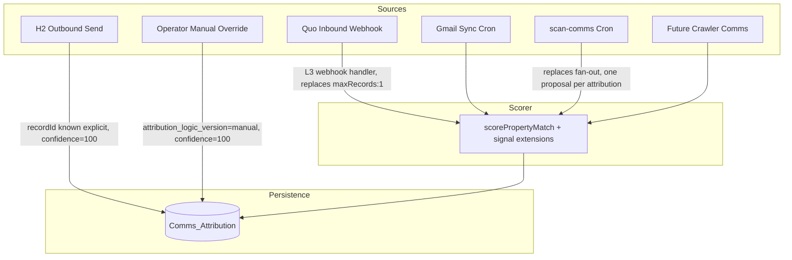

# Attribution Layer v1 — Architectural Spec

**Document version:** v1.0
**Authored:** 2026-05-20 (Code — architectural design, not implementation)
**Branch:** `claude/test-firecrawl-egress-fkpyY`
**Scope:** DESIGN-ONLY. No persistence-table creation. No code modifications. No Make scenario edits. Every section traces back to INV-007 audit findings.
**Companion specs:** `AKB_Belt_v1_Spec.md` §6 (Source-of-truth communications principle), `docs/investigations/Multi_Listing_Agent_Attribution_Audit_v1.md` (root-cause audit), `docs/investigations/Active_Queue.md` (INV-007 / INV-014 / INV-015 / INV-016).

---

## §1 — Problem statement & scope

### What this spec solves

Per `docs/investigations/Multi_Listing_Agent_Attribution_Audit_v1.md`, the system today has **five independent attribution behaviors** for the same problem — assigning a Quo or Gmail message to a specific `Listings_V1` record when an agent holds multiple listings sharing one phone number / email:

1. `/api/deal-context/[id]` — scored attribution via `scorePropertyMatch` + `mergeTimeline` (drives AMBIGUOUS banner).
2. `/api/conversations/[id]` — **as of commit `5252ec0` (INV-007 Step 1)**, now filters via the exported `scorePropertyMatch` with a 0.6 confidence floor; pre-Step-1 behavior was zero attribution.
3. L3 Make Scenario `4812756` — `maxRecords: 1` no-sort Airtable lookup (winner-takes-all, non-deterministic). **INV-014**.
4. `/api/cron/scan-comms` — fans out one inbound to N proposals (one per listing in phone group). **INV-015**.
5. `/api/multi-listing-detect` — runs `mergeTimeline` per sibling combination, surfaces ambiguous samples to a disambiguation queue.

Step 1 closed the user-visible leak at path #2 by exporting the scorer and reusing it in-place. **The structural divergence remains** — paths #3 and #4 still write incorrect / fan-out attribution to Airtable + Agent_Proposals, contaminating downstream state regardless of what the renderer shows. This spec describes the unified layer that all five paths converge on.

### Attribution defined precisely

For this spec, **attribution** is a deterministic mapping:

```
(message_id, source_system) → (record_id, confidence, attribution_logic_version, ambiguous_flag, evidence)
```

- **message_id**: stable identifier from the source system (Quo `id`, Gmail message id, etc.).
- **source_system**: `"quo_sms"` | `"gmail"` | `"crawler:<adapter>"` (future) | `"manual"`.
- **record_id**: the Listings_V1 record this message is attributed to. May be empty when ambiguous.
- **confidence**: integer 0–100. Step 1's 0.6-on-a-0-1-scale becomes 60-on-0-100 for storage clarity (see §5).
- **attribution_logic_version**: a string captured at write-time identifying which scorer + threshold profile produced the row (e.g., `"scorePropertyMatch@v1.2"`). Supports forward evolution of the scorer without losing audit trail.
- **ambiguous_flag**: boolean. True when confidence falls between operator-defined ambiguity bands (see §5).
- **evidence**: short JSON capturing which signals contributed (token-match, listing-at-phrase, price-match, sibling-override, recency-boost, manual-override). Audit trail for "why was this attributed to this record?"

### Scope

In-scope source systems:
- **Quo inbound** (SMS from listing agents) — primary attribution challenge.
- **Quo outbound** (SMS to listing agents) — high-confidence at SEND-time because the originating record is known explicitly.
- **Gmail inbound / outbound** — analogous to Quo with the added complication of multi-thread email chains.
- **Future Crawler-sourced comms** (per Belt v1 Spec §3.5 handoff contract) — agent replies that arrive via off-MLS channels (probate-county outreach, etc.).

Out of scope:
- `/api/deal-context/[id]`'s `mergeTimeline` call. **Kept** — Step 2 changes the source of attribution data, not the merge orchestration.
- `/api/multi-listing-detect`'s ambiguity-detection logic. **Kept** — it becomes a consumer of the new layer instead of a producer.
- Step 1's in-place filter at `/api/conversations/[id]`. **Removed in §6 migration** — replaced by the same Comms_Attribution query.

Out of spec entirely:
- Any change to the H2 send pipeline beyond the addition of an attribution write.
- Changes to Quo / Gmail vendor integrations (no new fields requested from Quo).
- UI redesign of the disambiguation queue (separate operator decision in §8).

---

## §2 — Persisted attribution storage design

The core architectural decision is **where the attribution lives**. Two viable substrates; both have trade-offs.

### Option A — Airtable `Comms_Attribution` table (on `appp8inLAGTg4qpEZ`)

| Column | Type | Notes |
|---|---|---|
| `Message_Id` | singleLineText (primary key) | composite: `<source_system>:<vendor_message_id>` |
| `Source_System` | singleSelect | `quo_sms` / `gmail` / `crawler:*` / `manual` |
| `Record_Id` | multipleRecordLinks → Listings_V1 | the attributed property |
| `Confidence_Score` | number (precision 0) | 0–100 |
| `Attribution_Logic_Version` | singleLineText | e.g., `"scorePropertyMatch@v1.2"` |
| `Ambiguous_Flag` | checkbox | true when 0–59 |
| `Evidence_JSON` | multilineText | short JSON; signals that contributed |
| `Attributed_At` | dateTime | ISO timestamp |
| `Direction` | singleSelect | `inbound` / `outbound` / `system` |
| `Message_Timestamp` | dateTime | from source system; for time-windowed queries |
| `Message_Body_Snippet` | singleLineText | first 240 chars for queue UI / audit |
| `Agent_Phone_E164` | singleLineText | for phone-group queries |

**Pros:**
- Consistent data plane with rest of system (Listings_V1, Spine_Decision_Log, Agent_Proposals all live on the same base).
- Operator can inspect and manually edit rows via Airtable UI (useful for manual override / disambiguation).
- Linkable to Listings_V1 records — joins follow existing patterns.
- Free; no additional infra cost; no Hobby-plan implication.
- Query patterns already known to Code (used Airtable MCP extensively in INV-001/002/007).

**Cons:**
- Rate-limited (~5 req/sec per base; bursts up to ~10/sec). At current ingest scale (~50–200 messages/day) this is not a constraint, but **writes are not free** at higher scale.
- Reads are slower than Postgres (typical 100–400ms per filtered query depending on table size).
- Schema is constrained by Airtable's field types — no compound indexes; query performance degrades as table grows.

### Option B — Vercel-native (Vercel Postgres / Vercel KV)

A separate persistence layer, queried directly from Vercel routes via `@vercel/postgres` (or KV for simpler key-value patterns).

```sql
-- Indicative schema (Postgres)
CREATE TABLE comms_attribution (
  message_id TEXT PRIMARY KEY,         -- "quo_sms:msg_abc123"
  source_system TEXT NOT NULL,
  record_id TEXT NOT NULL,             -- Airtable rec...
  confidence_score INT NOT NULL CHECK (confidence_score BETWEEN 0 AND 100),
  attribution_logic_version TEXT NOT NULL,
  ambiguous_flag BOOLEAN NOT NULL,
  evidence_json JSONB,
  attributed_at TIMESTAMPTZ NOT NULL DEFAULT NOW(),
  direction TEXT NOT NULL CHECK (direction IN ('inbound', 'outbound', 'system')),
  message_timestamp TIMESTAMPTZ NOT NULL,
  message_body_snippet TEXT,
  agent_phone_e164 TEXT
);
CREATE INDEX idx_record_confidence ON comms_attribution(record_id, confidence_score DESC);
CREATE INDEX idx_phone_timestamp ON comms_attribution(agent_phone_e164, message_timestamp DESC);
CREATE INDEX idx_ambiguous ON comms_attribution(ambiguous_flag) WHERE ambiguous_flag = TRUE;
```

**Pros:**
- Fast reads at scale (sub-50ms typical for indexed queries).
- No API rate limits on the data plane itself (limits apply at the Vercel runtime layer instead, which is more generous).
- Real SQL: compound indexes, JOINs, partial indexes, JSONB queries on `evidence_json`.
- Independent of Airtable's update cycle — attribution row writes don't compete with Listings_V1 mutation traffic.

**Cons:**
- Separate data plane — operator cannot inspect/edit rows via Airtable UI. Manual override requires a new endpoint (or an admin UI).
- Vercel Postgres free tier: 256MB storage / 60 hours compute / month. At current scale, fits comfortably. **At 10× scale (~1k msgs/day), still fits.** Paid tier required only if Comms_Attribution grows past tens of millions of rows.
- Requires ORM / query-layer setup (Drizzle, Prisma, or raw `sql` tagged templates) — net new code area for this codebase.
- Disaster-recovery story is separate from Airtable's (Airtable has trash-restore, point-in-time recovery on paid plans; Postgres has its own backup story per Vercel).

### Read-load analysis

Estimated query volume per consumer at current scale:

| Consumer | Trigger | Queries/day (low estimate) | Queries/day (high estimate) |
|---|---|---|---|
| `/api/deal-context/[id]` | deal page open | ~20 | ~200 |
| `/api/conversations/[id]` | deal page open | ~20 | ~200 |
| `/api/multi-listing-detect` | daily cron | ~10–30 (per multi-listing group) | ~50–100 |
| Sentinel queue | sentinel page open | ~5–20 | ~50 |
| Manual override (operator) | disambiguation queue clicks | ~5 | ~30 |
| **Total reads** | | **~60–95** | **~530–680** |

Estimated write volume:

| Writer | Trigger | Writes/day (low) | Writes/day (high) |
|---|---|---|---|
| H2 outbound | per send | ~20 | ~100 |
| L3 inbound | per webhook | ~10 | ~80 |
| scan-comms cron | hourly | ~10 | ~50 |
| Gmail sync | hourly | ~5 | ~30 |
| Re-attribution job (§5) | nightly | ~5–20 (touched rows) | ~30 |
| **Total writes** | | **~50–60** | **~290** |

**Total daily volume: ~110–970 read+write ops.** Well under either substrate's headroom at current scale. **Substrate choice is not driven by performance** at MVP scale — it's driven by data-plane consistency (Option A) vs query flexibility (Option B).

### Recommendation surfaced (operator decides — §8)

**Option A (Airtable) is the path-of-least-resistance** for the current Inevitable phase: consistent with the rest of the system, operator can inspect/edit in the UI, zero new infrastructure. Migration to Option B is straightforward if scale or query complexity later demands it (the abstraction in §4 hides the substrate from consumers).

**Operator must choose** before Sprint 1 begins. Choice is locked at first table creation; later migration costs ~1 sprint.

---

## §3 — Ingest-time attribution

The architectural shift: **attribution is computed once at ingest** and persisted. Renderers consume the persisted row. Every system that previously made its own attribution decision now writes to the same table.

### Flow diagram



### Per-source ingest contracts

**Quo inbound (replaces L3 winner-takes-all, resolves INV-014):**

- Today's path: Make Scenario `4812756` receives webhook → ActionSearchRecords finds Listings_V1 by phone with `maxRecords: 1` no-sort → updates whichever record Airtable returns first.
- New path: webhook fires either Make L3 (revised) OR a new Vercel route (`/api/webhooks/quo-inbound`). Either way:
  1. Pull all Listings_V1 records where `cleanPhone(Agent_Phone) === cleanPhone(inbound.from)`.
  2. Compute attribution: if 0 matches → write `record_id = ""`, `confidence = 0`, `ambiguous_flag = true`. If 1 match → write `record_id = match.id`, `confidence = 100`, `ambiguous_flag = false`. If N > 1 matches → run `scorePropertyMatch` against each, write attribution for the best match (with `ambiguous_flag` set per confidence band).
  3. After persistence: L3 routes by content (Rejection / Negotiation / Default First Response / Append-only) but acts on the persisted `record_id` instead of the search-result first-bundle.
- **Pre-existing L3 behavior preserved:** writes to `Outreach_Status` + `Verification_Notes` on the attributed record continue. Only the *target selection* changes.

**Quo outbound (H2 send — write at send-time):**

- Today's path: H2 sends SMS via `/api/outreach-fire` → updates Listings_V1 fields (`Outreach_Status = "Texted"`, `Last_Outreach_Date`). No attribution row.
- New path: after successful Quo `sendMessage` (post-Positive-Confirmation), write a Comms_Attribution row with `record_id = listing.id` (explicit, no scorer needed), `confidence = 100`, `attribution_logic_version = "outbound_explicit@v1"`, `direction = "outbound"`. **High-confidence write — no ambiguity possible.**
- This is the **anchor data** for the recency-boost signal in §5 (inbound replies are statistically about the most-recently-outbound-to record).

**scan-comms cron (replaces fan-out, resolves INV-015):**

- Today's path: `app/api/cron/scan-comms/route.ts:228-262` groups listings by phone, for each inbound message creates an `Agent_Proposals` row for EVERY listing in the group.
- New path: for each phone with ≥1 listing in actionable status:
  1. Pull recent inbound messages for the phone.
  2. For each inbound that does NOT yet have a Comms_Attribution row (`message_id` lookup): compute attribution via `scorePropertyMatch` with the listings as candidates. Write one Comms_Attribution row.
  3. For each inbound that DOES already have a Comms_Attribution row (e.g., written by L3 webhook earlier): respect the existing attribution; do not overwrite.
  4. Generate an Agent_Proposals row **only for the attributed record_id** (or for the unattributed-pool if confidence < threshold). Eliminates fan-out.

**Gmail sync (new — or extends existing Gmail polling):**

- Today's path: `lib/gmail.ts` polls Gmail; deal-context's `getThreadsForEmail(agentEmail)` pulls per render.
- New path: a polling cron (or post-fetch hook) writes Comms_Attribution for each Gmail message keyed by `gmail:<message_id>`. Same scorer; subject + body are concatenated for scoring (subject often carries property address).

**Manual operator override:**

- Disambiguation-queue UI affordance: operator clicks "attribute message X to record Y" → POST to `/api/attribution/override` → upserts Comms_Attribution row with `attribution_logic_version = "manual@v1"`, `confidence = 100`, `evidence_json = {"operator_id": ..., "reason_text": ...}`. **Manual overrides always win** in render-time queries (highest precedence per §5).

### Scorer evolution path (resolves potential INV-016 absorption)

Step 1 exported `scorePropertyMatch` from `lib/timeline-merge.ts`. Step 2 **consumes** that exported scorer at ingest time. **It does not duplicate scoring logic in five places.**

The scorer's signals today:
- `+60` (was +0.6) token-match against address tokens >2 chars
- `+20` (was +0.2) `"listing at"` / `"property at"` phrase + address-token follow
- `+30` (was +0.3) `$N,NNN` within $1,000 of `List_Price` ← **INV-016**: H2 outbound contains Offer (≈ 65% × List_Price), not List_Price. Bonus doesn't fire on H2.

Step 2 absorption path: extend `scorePropertyMatch` to compare price tokens against BOTH `List_Price` AND `Outreach_Offer_Price` (the 65%-of-List value persisted on Listings_V1 by H2 at send-time). One scorer change; all five ingest points benefit automatically. Resolves INV-016 cleanly within the Step 2 work.

Version bump: when this fix lands, `attribution_logic_version` advances (e.g., `"scorePropertyMatch@v1.0"` → `"scorePropertyMatch@v1.1"`). Rows written before the bump retain their original version stamp — audit trail intact.

### What L3 still does

L3 is **not retired** by Step 2. L3's content-routing logic (Rejection / Negotiation / Default First Response / Append-only routes; Outreach_Status transition writes) remains useful. What changes is:

- L3's record-selection step (currently `maxRecords: 1`) gets replaced with a Comms_Attribution lookup OR a wrapping Vercel route that does the lookup and hands L3 the right record.
- One viable shape: a new Vercel route `/api/webhooks/quo-inbound` receives the Quo webhook directly, writes attribution, then triggers L3 via Make webhook with the resolved `record_id` in the payload. L3's filter becomes `{{1.record_id}}` lookup instead of phone search. Cleanest separation.

Operator decides at build time whether L3 stays in Make with a thinner role, or migrates to a Vercel-native handler entirely. The attribution layer doesn't care; both shapes consume Comms_Attribution.

---

## §4 — Render-time consumption

The mirror shift: **renderers do not compute attribution.** They query Comms_Attribution and present.

### Flow diagram

```mermaid
flowchart LR
    subgraph Consumers
        DC[/api/deal-context/id/]
        CV[/api/conversations/id/]
        MLD[/api/multi-listing-detect]
        SQ[/api/sentinel/queue]
        OPS[Operator UI - disambiguation queue]
    end

    subgraph Persistence
        TABLE[(Comms_Attribution)]
    end

    TABLE -->|WHERE record_id = X AND confidence >= 60| DC
    TABLE -->|WHERE record_id = X AND confidence >= 60| CV
    TABLE -->|WHERE ambiguous_flag = true GROUP BY agent_phone| MLD
    TABLE -->|JOIN Listings_V1 ON record_id| SQ
    TABLE -->|WHERE ambiguous_flag = true ORDER BY message_timestamp DESC| OPS
```

### Per-consumer migration

**`/api/deal-context/[id]`** (today calls `mergeTimeline`):
- Step 2: replace the per-render `scorePropertyMatch` calls inside `mergeTimeline` with a Comms_Attribution lookup keyed by message_id (after Quo / Gmail fetch). `mergeTimeline`'s timeline-assembly + dedup logic stays. Its scorer-call sites become lookups.
- Net effect: same `{timeline, ambiguous}` return shape. Same `dealContext.ambiguousMessages` field. Same AMBIGUOUS banner. **API contract unchanged for callers.**

**`/api/conversations/[id]`** (today uses Step 1's in-place filter):
- Step 2: after Quo fetch, query Comms_Attribution for the fetched message_ids; filter to rows where `record_id === current_id AND confidence >= 60`; render messages whose ids appear in the result set.
- **Step 1's inline `scorePropertyMatch` call is removed** in Sprint 4 (see §6).

**`/api/multi-listing-detect`** (today computes ambiguity via `mergeTimeline` per sibling combo):
- Step 2: query `WHERE ambiguous_flag = true GROUP BY agent_phone_e164`. The "compute ambiguity per sibling combination" loop becomes a single SELECT.
- DISAMBIGUATION_QUEUE_TABLE writes still happen; source data now comes from a faster query.

**`/api/sentinel/queue`** (today filters by `lastInboundAt > lastOutboundAt`):
- Step 2: optional enhancement — join Comms_Attribution to enrich each queue row with confidence stats ("32 attributed inbound · 4 ambiguous"). Not required for Step 2 functional completion. Operator decides.

**Disambiguation queue UI**:
- New surface or expansion of existing JarvisGreeting `ambiguousQueue` badge. Operator sees one row per ambiguous message with context (body snippet, candidate recordIds, current best-guess + confidence). Click → attribution override → Comms_Attribution row with `attribution_logic_version = "manual@v1"`.

### Confidence threshold canonical value

Step 1 used 0.6 (= 60 on the 0–100 scale). **Step 2 retains 60 as the render-time floor** by default. The choice is revisitable in §8 once data on the actual confidence distribution accumulates post-launch.

---

## §5 — Re-attribution & confidence updates

The attribution layer is **append-mostly, not write-once**. New evidence resolves old ambiguity.

### Confidence model (formalized from audit §4)

| Score | Class | Behavior |
|---|---|---|
| **80–100** | `deterministic` | Renders in property thread. No badge. No queue presence. |
| **60–79** | `best-guess` | Renders in property thread WITH `[best-guess]` badge (UI affordance — operator can re-attribute). Not ambiguous-flagged. |
| **40–59** | `ambiguous` | Does NOT render in any property thread. Held in disambiguation queue. `ambiguous_flag = true`. |
| **0–39** | `unattributed` | Does NOT render. Held in disambiguation queue. `ambiguous_flag = true`. |

Signal contributions (per the scorer extension proposal):

| Signal | Contribution | Notes |
|---|---|---|
| Token-match (address tokens >2 chars, ≥50% present) | `+60` | Existing. Works correctly on H2 outbound. |
| `"listing at"` / `"property at"` phrase + address token follow | `+20` | Existing. Works correctly on H2 outbound. |
| `$N,NNN` near `List_Price` OR `Outreach_Offer_Price` (±$1,000) | `+30` | **INV-016 fix — extend price comparison to both fields.** |
| Outbound→inbound recency (≤6h gap, no intervening outbound to other recordId) | `+30` | **New signal — disambiguates short-reply inbounds with no body signal.** |
| Active-status prior (Negotiating / Response Received) | `+15` | **New signal — sibling state prior.** |
| Dead-status penalty | `−30` | **New signal — explicitly dead listings less likely the subject.** |
| Manual override | `100` (sets, not adds) | Always wins. `attribution_logic_version = "manual@v1"`. |

### Re-attribution triggers

**Event-driven re-attribution:**
- When new inbound arrives, run a re-attribution pass over the prior 7 days of `ambiguous_flag = true` rows for the same `agent_phone_e164`. The new inbound may carry context (e.g., agent says "yes, the one on Pawnee") that resolves previously-ambiguous prior messages.
- Implementation: cheap query (single phone, 7-day window). Runs synchronously after the new-inbound attribution write.

**Scheduled sweep:**
- Daily cron (Hobby plan limit) revisits all `ambiguous_flag = true` rows from the last 14 days. Re-runs scorer with current data (sibling listings may have changed status; new outbound may have happened). Updates `confidence_score` and `ambiguous_flag` accordingly.
- Each update increments `attribution_logic_version` to the current scorer version. Audit trail of when an ambiguous message moved to deterministic.

**Manual operator override (synchronous):**
- Highest-precedence write. `attribution_logic_version = "manual@v1"`, `confidence = 100`. Subsequent automatic re-attribution sweeps skip rows with `attribution_logic_version` starting with `"manual@"`. **Operator override is sticky.**

### Re-attribution does NOT delete history

Updates overwrite confidence_score / record_id / ambiguous_flag / evidence_json on the existing row. **They do not delete the row or write a sibling row.** The `attribution_logic_version` change captures the upgrade. If operator needs deep history of all attribution versions for a message, that's a future enhancement (Spine_Decision_Log-style audit appendix on the row, deferred to v2).

---

## §6 — Migration path

The path from "five divergent attribution behaviors" to "one unified layer" runs over four sprint boundaries. **The system remains functional at every boundary.**

### Backfill policy (per `Active_Queue.md` footer, operator-codified 2026-05-20)

Pre-Inevitable Crawler 1.0 messages: **NOT backfilled.** Records without a Comms_Attribution row simply do not appear in attributed views post-cutover. Acceptable degradation for historical data; the historical messages are visible in Quo's own conversation history if operator needs to dig.

### Step 1 inline filter retirement

Commit `5252ec0` (INV-007 Step 1) added an in-place `scorePropertyMatch` call inside `/api/conversations/[id]`. This is replaced in Sprint 4 by the same render-time Comms_Attribution query that deal-context will already be using (Sprint 3). **Clean replacement, no coexistence period after Sprint 4 cutover.**

### Contradiction check (per stall conditions)

Step 1's filter uses `confidence < 0.6` (== 60 on the persisted scale). Step 2's render-time floor is also 60. **No contradiction.** If Step 2 later raises the floor based on observed data, it raises it for ALL consumers simultaneously (the abstraction in §4 hides the threshold from each consumer's call site).

### Cutover sequence

| Step | Migration | System state after | Functional? |
|---|---|---|---|
| **a** | Create `Comms_Attribution` table (Sprint 1) | Table exists, empty | ✓ — no consumers yet |
| **b** | H2 outbound writes attribution at send-time (Sprint 1) | New outbound messages have attribution rows; renderers ignore them | ✓ — additive |
| **c** | L3 inbound rewrites to write attribution (Sprint 1) | New inbound has attribution rows. L3 still does its content routing on the resolved record. **INV-014 resolved.** | ✓ — L3 still updates Outreach_Status, just on the right record |
| **d** | scan-comms writes attribution; fan-out replaced (Sprint 2) | New inbounds in the cron path get one proposal per attribution, not N. **INV-015 resolved.** | ✓ — operator now sees 1 proposal where they used to see N (behavior change, but functional) |
| **e** | Gmail sync writes attribution (Sprint 2) | Email messages have attribution rows; renderers still ignore | ✓ — additive |
| **f** | `/api/deal-context/[id]` consumes Comms_Attribution (Sprint 3) | deal-context query swaps; AMBIGUOUS banner driven by `ambiguous_flag` rows | ✓ — same API contract, faster reads |
| **g** | `/api/conversations/[id]` consumes Comms_Attribution; Step 1 inline filter removed (Sprint 3 + early Sprint 4) | conversations query swaps; visible leak still closed via persisted attribution | ✓ — Step 1 filter and Step 2 query produce same filter result (both at 0.6/60 threshold) |
| **h** | `/api/multi-listing-detect` consumes Comms_Attribution (Sprint 3) | ambiguity detection becomes a single SELECT | ✓ — same disambiguation queue surface |
| **i** | Re-attribution job lands (Sprint 4) | nightly sweep + event-driven re-attribution + manual override endpoint | ✓ — new affordance, doesn't break existing flows |
| **j** | Sprint 4 cleanup: Step 1 filter removed, scorer absorbs INV-016 price-match fix, `attribution_logic_version` bumps | Code clean; one scorer; one threshold; one storage table | ✓ — terminal state |

**At step (g), there is a transient state** where Step 1's inline filter AND Step 2's render-time query both gate the same messages. They produce identical results (same scorer, same threshold). No double-filtering bug. Operator can verify by curl + diff: the filtered message set is identical before and after the inline-filter removal.

---

## §7 — Build sequence

Four sprints. Each independently deployable and testable. **Bias toward early Sprint 1 wins to establish persisted attribution as a working primitive before migrating consumers.**

### Sprint 1 — Persistence + first ingest writes

**Goal:** Comms_Attribution table exists, populated by H2 outbound + L3 inbound. Renderers untouched.

**Deliverables:**
- Table created (Option A or B per §8 decision)
- `lib/attribution/storage.ts` (or equivalent) abstraction layer with `writeAttribution(input)` / `readAttribution(messageIds)` / `readByRecord(recordId, opts)` functions. **All future ingest + render code calls through this layer** — substrate swappable.
- H2 outbound calls `writeAttribution` post-send-success
- L3 webhook rework — either Make scenario edit (replace search step) or new Vercel route preceding L3 — writes attribution; L3 routes on resolved record_id
- INV-014 resolved

**Acceptance criteria:**
- Send one H2 outbound → row in Comms_Attribution with `confidence = 100`, `direction = "outbound"`, attributed to the correct record
- Send Candice an inbound reply → row in Comms_Attribution with attribution from scorer; L3 updates `Outreach_Status` on the attributed record (not a random one)
- For a multi-listing agent with 4 listings, sending one inbound produces exactly one Comms_Attribution row, attributed to the best-scored property

### Sprint 2 — Remaining ingest paths

**Goal:** scan-comms + Gmail sync write Comms_Attribution. INV-015 resolved.

**Deliverables:**
- scan-comms cron writes attribution per inbound; produces ONE proposal per attribution (eliminates fan-out)
- Gmail sync writes attribution; subject + body concatenated for scoring
- Future Crawler hook stub (writes via `writeAttribution` when Crawler 2.0 lands; out of scope for this sprint to BUILD the Crawler)
- INV-015 resolved

**Acceptance criteria:**
- One Candice inbound during scan-comms window → exactly one Agent_Proposals row (was 4 pre-sprint)
- Gmail inbound from Candice → attribution row with subject-derived address tokens contributing to confidence

### Sprint 3 — Render-time migration

**Goal:** Renderers stop computing attribution; consume the persisted layer.

**Deliverables:**
- `/api/deal-context/[id]` queries Comms_Attribution; same `{timeline, ambiguous}` API contract
- `/api/conversations/[id]` queries Comms_Attribution; same UnifiedMessage[] API contract; **Step 1 inline filter still active** (safety net)
- `/api/multi-listing-detect` queries `WHERE ambiguous_flag = true`; same disambiguation queue writes
- AMBIGUOUS banner driven by Comms_Attribution rows (count of `ambiguous_flag = true` for the record's phone group)

**Acceptance criteria:**
- For 23 Fields Ave (`rec1HTUqK0YEVb7uA`): conversation panel shows same messages before and after Sprint 3 cutover (Step 1 filter + Step 2 query both excluding 3273 Steele outbound)
- AMBIGUOUS banner count consistent with `ambiguous_flag = true` row count
- multi-listing-detect cron runs in <2 seconds (was: per-sibling-combo scoring loops)

### Sprint 4 — Re-attribution, cleanup, scorer upgrade

**Goal:** Terminal state. One scorer. One threshold. One storage table. INV-016 absorbed.

**Deliverables:**
- Nightly re-attribution sweep (daily Hobby-plan cron)
- Event-driven re-attribution after new inbound
- Manual override endpoint + disambiguation queue UI affordance (if scope permits; otherwise queue UI is a separate v2 deliverable)
- Step 1 inline filter at `/api/conversations/[id]` removed
- `scorePropertyMatch` extended to compare price tokens against BOTH `List_Price` AND `Outreach_Offer_Price` (INV-016)
- Active-status prior signal + Dead-status penalty added to scorer
- Outbound→inbound recency signal added to scorer
- `attribution_logic_version` bumps to `"scorePropertyMatch@v1.1"`; old rows retain v1.0 stamp

**Acceptance criteria:**
- Ambiguous message from 7 days ago becomes deterministic after a fresh disambiguating inbound (event-driven sweep verified)
- Operator clicks "attribute to Pawnee" in queue → row updates; subsequent renderer shows message in Pawnee thread only
- `npm run typecheck` + existing test suite green
- `lib/timeline-merge.test.ts` exists with coverage of `scorePropertyMatch` (gap from Active_Queue closed)

### Cross-sprint dependencies

- Sprint 2 depends on Sprint 1 (`writeAttribution` abstraction must exist)
- Sprint 3 depends on Sprint 1 + Sprint 2 (consumers need writers to have populated the table first)
- Sprint 4 depends on Sprint 3 (re-attribution touches already-consumed rows)
- **No sprint can be skipped or reordered.** Each builds on the prior.

---

## §8 — Open questions

### Decisions requiring operator input before Sprint 1

1. **Storage substrate** (§2): Airtable Comms_Attribution table vs Vercel-native (Postgres/KV). Recommendation: Airtable for path-of-least-resistance at current scale; migration to Vercel-native straightforward later if needed. Operator decides.
2. **Confidence threshold canonical value** (§4, §5): Step 1 used 60 (= 0.6 in legacy scale). Step 2 retains 60. Operator may wish to revisit after Sprint 3 cutover when confidence distribution data accumulates. Locked-for-now at 60.
3. **Manual override UI surface** (§4 disambiguation queue): is the existing JarvisGreeting `ambiguousQueue` badge sufficient as the entry point, or does Step 2 need a dedicated `/disambiguation` page? Operator workflow input needed. **If existing badge is sufficient, Sprint 4 ships a simple endpoint (no new page). If a queue page is needed, that's its own Sprint 4 or Sprint 5 work.**

### Architectural unknowns flagged

4. **Re-attribution sweep cadence** (§5): nightly is the Hobby-plan default. Is nightly fast enough, or does the operator need finer (event-driven only)? Event-driven is already proposed; question is whether the scheduled sweep adds value or is paranoid duplication. Decision deferred until Sprint 4 design.
5. **L3 architectural home**: stays in Make with thinner role vs migrate to Vercel-native handler entirely. Both shapes work with Step 2's attribution layer. Operator-decided at Sprint 1 build start. Related to broader Belt v1 Spec §3 Phase 20.1 trigger-mode question.
6. **Out-of-band attribution sources**: in-person calls logged manually, voicemail transcripts, etc. — should they be in scope for the attribution layer? Out of scope for v1; flagged for v2 if operator workflow demands it.

### Dependencies on deferred work

7. **`scorePropertyMatch` unit-test coverage gap** (Active_Queue "Discovered" unnumbered entry): addressed naturally in Sprint 4 (test file added alongside scorer extension). No separate brief needed unless operator wants tests earlier (could land in Sprint 1 if scorer is touched there).
8. **INV-016 (price-match misaligned)**: folded into Sprint 4 scorer extension per §3. INV-016 closes when Sprint 4 lands. **Resolved by Step 2, no separate remediation work.**
9. **Crawler 2.0 comms ingest**: Comms_Attribution v1 schema includes `source_system = "crawler:*"` as a forward-compat affordance. Crawler 2.0 builds out the actual adapters; attribution layer is ready to receive them.

### Items explicitly NOT designed in this spec

- The disambiguation queue UI (page layout, button placement, batch operations) — operator workflow design separate from this architecture spec
- Storage-substrate migration tooling (if operator picks Option A and later wants Option B) — write a separate migration spec when needed
- Cross-source dedup (Quo SMS body identical to a Gmail body) — existing dedup logic in `timeline-merge.ts` survives Step 2; Comms_Attribution doesn't change dedup behavior
- AI-assisted re-attribution (vision/LLM-based body comprehension beyond keyword matching) — interesting v2 enhancement; not in v1 scope

---

*End of design. No new fields, scenarios, env vars, or external dependencies created — all candidates flagged in §8 awaiting operator decision. Spec is implementable as a 4-sprint sequence once §8 #1 (storage substrate) is operator-decided.*

**Resolves on build:** INV-007 Step 2, INV-014, INV-015, INV-016. `scorePropertyMatch` unit-test gap closed in Sprint 4. Step 1's surgical patch (commit `5252ec0`) cleanly removed in Sprint 4.
